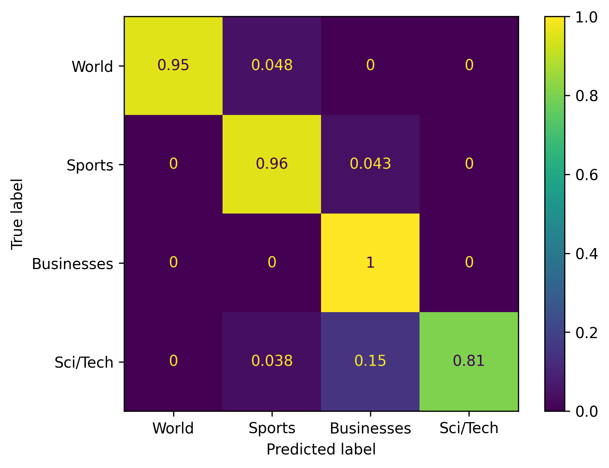

# LLM Text Classification Report

**Model:** gemma-3-12b-it  
**Dataset:** AG News Dataset  
**Objective:** Comparison of different prompting strategies in terms of accuracy and token efficiency.
---
The goal of this study is to design effective prompts that can accurately classify news headlines from AG News Dataset into four categories (World, Sports, Businesses, Sci/Tech) using various prompting techniques. In addition to classification performance, the **accuracy-efficiency balance** of the prompts has been evaluated by considering the number of tokens used.

>* **Gemma 12B** has been chosen as the model. The reason for selecting a model with this number of parameters is to better observe the impact of different prompting strategies on the results.
>* Tests have been conducted on **100** news articles. To obtain consistent results for each test, **seed 42** has been set for news selection, **temperature 0.0** has been configured. In this way, the model's outputs have been consistent and reproducible.

**Token Count:**  
Token counts for each classification have been measured using Gemini API's *usage_metadata* information. The input token count has been taken from *prompt_token_count* and output token count has been calculated by analyzing the model's response using the *count_tokens()* function.

**Metric Calculation Method:**  
`accuracy_score`, `precision_recall_fscore_support` and `confusion_matrix` functions from the 'scikit-learn' library have been used to evaluate classification results.  
F1 score, precision and recall values have been calculated using "macrp average" method, giving equal weight to all classes.  
Confusion matrix results have also been visualized by normalizing them.  


The prompts presented below have been designed according to different strategies and the test metrics obtained from each are detailed in the classification_report.txt file.

---

## Prompts to be Evaluated

### Prompt 1 (Test 2): "Zero-Shot + Media Analyst Role"
This is one of the simplest prompts. A Media Analyst role has been defined for the model to understand its role. While it performs well in "Sports" and "World" categorşes, it struggles with "Sci/Tech" and "Businesses".  
**Suitable for high accuracy and economical classification.**

```
You are a media analyst evaluating the topic and focus of news articles for content classification.
Your task is to classify the following news article into one of the following categories:
World, Sports, Businesses, Sci/Tech

Respond with ONLY the label, and nothing else.

Text: "{text}"
Label:
```

| Test | Prompt Type         | Accuracy | Precision | Recall | F1 Score | Avg Total Tokens |
| ---- |---------------------| -------- | --------- | ------ | -------- |------------------|
| 2    | Zero-Shot + Analyst | 0.89     | 0.92      | 0.89   | 0.89     | 114.98           |


---

### Prompt 2 (Test 12): "Few-Shot + Few-Shot + Justification (CoT)"
In this prompt, the model is shown an example for each class and asked to write a brief justification supporting its classification decision. This approach is more costly. The aim here is to generate tokens that will steer the model to the correct conclusion.
"Models need tokens to think" hypothesis is intended to be tested.  
**Suitable for higher accuracy classification.**


````
You are a media analyst evaluating the topic and focus of news articles for content classification.
Classify the following news article into one of the following categories: World, Sports, Businesses, Sci/Tech
First, write a concise one-sentence justification
Then, output ONLY the label on a new line.

Here are few examples, follow this exact format:
```
Text: Asteroid Toutatis Makes Closest Pass in 651 Years (Reuters) Reuters - An asteroid named for a Celtic god\of war will come as close to Earth this week as it has since\1353.
Justification: The article covers a scientific event involving an asteroid's close approach to Earth, which relates to space and technology.
Label: Sci/Tech

Text: NATO proclaims victory in Bosnia SARAJEVO, Bosnia-Herzegovina -- When NATO forces first came to Bosnia nearly a decade ago, they lived in heavily guarded compounds, patrolled the streets in tanks, and often wore full body armor.
Justification: The article discusses international military intervention and geopolitical developments involving NATO.
Label: World

Text: Google IPO: Type in 'confusing,' 'secrecy' I've submitted my bid to buy shares of Google Inc. in the computer search company's giant auction-style initial public offering. That could turn out to be the good news or the bad news.
Justification: The article focuses on Google's financial actions and the process of its public stock offering, which is a business topic.
Label: Businesses

Text: Hamilton Sets Early Pace as Woods Struggles KOHLER, Wis. (Reuters) - British Open champion Todd Hamilton made the first significant move in the U.S. PGA Championship final round Sunday as overnight pacesetter Vijay Singh prepared for an afternoon tee-off.
Justification: The article reports on the progress of professional golfers during a major sports tournament.
Label: Sports
```

Now classify this article:
Text: {text}
Justification:
Label:
````

| Test | Prompt Type                           | Accuracy | Precision | Recall | F1 Score | Avg Total Tokens |
| ---- |---------------------------------------|----------|-----------|--------|----------|------------------|
| 2    | Few-Shot + Role + Justification (CoT) | 0.93     | 0.94      | 0.93   | 0.93     | 486.56           |



---

| Test # | Strategy                              | Accuracy | F1 Score | Total Tokens  | Accuracy / Token | Notes                                                       |
|--------|---------------------------------------|----------|----------|---------------|------------------|-------------------------------------------------------------|
| 12     | Role + Few-Shot + Justification (CoT) | 93%      | 0.932    | 486.56        | 0.00191          | **Highest Performance**. Most expensive prompt.             |
| 11     | Few-Shot + Justification (CoT)        | 91%      | 0.910    | 468.29        | 0.00194          | Very high performance even without role assignment.         |
| 2      | Role + Zero-Shot                      | 89%      | 0.889    | 114.98        | 0.00774          | **Best Cost/Performance**. Very efficient.                  |
| 7      | One-Shot + Justification (CoT)        | 89%      | 0.888    | 214.12        | 0.00416          | Adding justification improves accuracy.                     |
| 4      | Role + Justification (CoT)            | 88%      | 0.879    | 174.85        | 0.00503          | CoT is effective even without examples.                     |
| 10     | Role + Few-Shot                       | 87%      | 0.871    | 356.84        | 0.00244          | Multiple examples alone not as effective as CoT.            |
| 16     | Role (Data Scientist) + One-Shot      | 86%      | 0.856    | 173.68        | 0.00495          | Role specificity doesn't significantly change outcome.      |
| 9      | Few-Shot                              | 86%      | 0.862    | 338.85        | 0.00254          | Less effective without justification or role.               |
| 3      | Justification (CoT)                   | 86%      | 0.860    | 156.22        | 0.00550          | Simplest CoT prompt, improves baseline performance.         |
| 17     | Role (Engine) + One-Shot              | 86%      | 0.859    | 167.05        | 0.00515          | "Engine" role not effective as "analyst".                   |
| 18     | Role (Engine) + MD + Few-Shot         | 85%      | 0.850    | 253.99        | 0.00335          | Markdown structure provided no extra benefit.               |
| 6      | Role + One-Shot                       | 85%      | 0.846    | 165.96        | 0.00512          | Worse than role-based zero-shot.                            |
| 15     | Role (SME) + One-Shot                 | 84%      | 0.832    | 175.96        | 0.00477          | Different roles yield similar results.                      |
| 14     | Role (Archivist) + One-Shot           | 84%      | 0.839    | 170.00        | 0.00494          | Different roles yield similar results.                      |
| 13     | Role (Editor) + One-Shot              | 84%      | 0.835    | 165.94        | 0.00506          | Different roles yield similar results.                      |
| 5      | One-Shot                              | 84%      | 0.833    | 147.94        | 0.00568          | Simplest few-shot, slightly better than zero-shot.          |
| 8      | Role + One-Shot + Justification (CoT) | 84%      | 0.828    | 233.28        | 0.00360          | Surprisingly low performance, possibly due to poor example. |
| 1      | Base Prompt (Zero-Shot)               | 82%      | 0.810    | 95.88         | 0.00855          | **Reference Point**. Lowest performance.                    |


### Accuracy / Token Efficiency Chart


*The chart shows the ratio of each request's accuracy to the total token cost.*

## Results and Evaluation

* #### **For Maximum Accuracy (High Cost):**
  **Prompt 12** should be used. The role defined in the prompt, multi-example strategy and the model's rationalization before giving its final answer achieved 93% accuracy with an average of 487 tokens used.


* ### **Cost-Effective Balanced Solution:** 
  **Prompt 12** should be used. An accuracy of 89% achieved by adding only a role demonstrates an excellent trade-off between performance and cost, with an average of 115 tokens per prompt. This is sufficient for many applications.  


* ### **Hybrid Solution:**  
  **Prompt 2** and **Prompt 12** should be used together. If the predicted category is "Sci/Tech" or "Businesses", the article is reclassifed with Prompt 12. Classification is requested for one of the two categories.