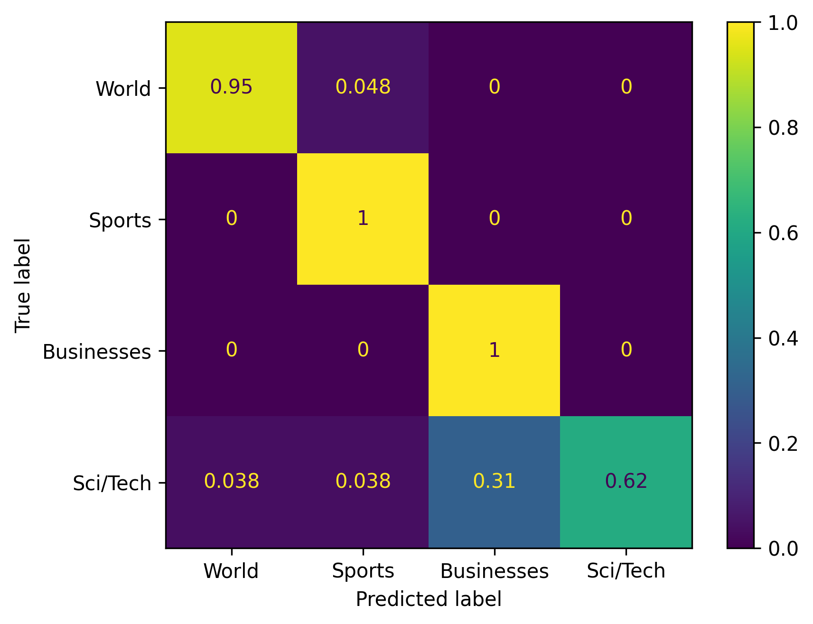
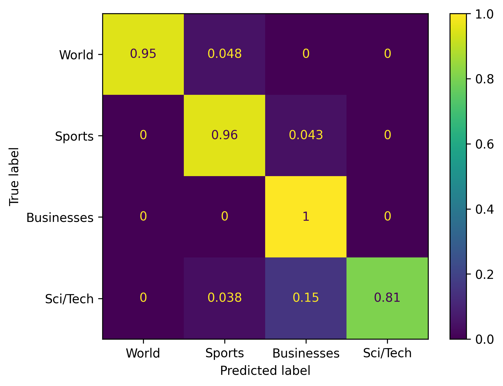
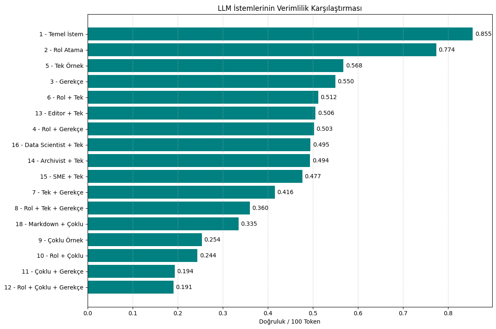

# LLM Metin Sınıflandırma Raporu

**Model:** gemma-3-12b-it  
**Veri Seti:** AG News Dataset  
**Amaç:** Farklı istem stratejilerinin doğruluk ve token verimliliği yönünden karşılaştırılması.  
---
Bu çalışmada amaç AG News veri setindeki haber başlıklarını, çeşitli istem teknikleri kullanarak dört sınıfa (World, Sports, Businesses, Sci/Tech) doğru bir şekilde sınıflandırabilecek etkili istemler tasarlamaktır. Sınıflandırma başarımının yanında, kullanılan token sayısı da dikkate alınarak istemlerin **doğruluk-verimlilik dengesi** değerlendirilmiştir.
  
* Model olarak  **Gemma 12B** tercih edilmiştir. Bu parametre sayısına sahip bir model seçilmesinin nedeni farklı istem stratejilerinin sonuca etkisini daha net görebilmektir.  
* Testler, **100** haber makalesi üzerinde gerçekleştirilmiştir. Her test için tutarlı sonuçlar elde etmek adına haber seçiminde **seed 42** belirlenmiş, **temperature 0.0** olarak ayarlanmıştır. Bu sayede modelin çıktıları tutarlı ve tekrarlanabilir olmuştur.

**Token Sayımı:**
Her sınıflandırmada kullanılan token sayıları, Gemini API’nin usage_metadata bilgisiyle ölçülmüştür. Girdi token sayısı prompt_token_count üzerinden alınmış, modelin ürettiği yanıt ise count_tokens() fonksiyonuyla analiz edilerek çıktı token sayısı hesaplanmıştır.

Aşağıda sunulan istemler farklı stratejilere göre tasarlanmış ve her birinden elde edilen test metrikleri classification_report.txt dosyasında detaylı haliyle sunulmuştur.

---

## Değerlendirilecek İstemler  

### İstem 1 (Test 2): "Zero-Shot + Media Analyst Rolü"
Bu istem en sade istemlerden biridir. Modelin rolünü kavraması için Media Analyst rolü tanımlanmıştır. "Sports" ve "World" kategorilerinde yüksek başarı gösterse de, "Sci/Tech" ve "Businesses" arasında karışıklık yaşamaktadır. 
**Yüksek Doğrulukta ve ekonomik sınıflandırma için uygundur.**

```
You are a media analyst evaluating the topic and focus of news articles for content classification.
Your task is to classify the following news article into one of the following categories:
World, Sports, Businesses, Sci/Tech

Respond with ONLY the label, and nothing else.

Text: "{text}"
Label:
```

| Test | Prompt Tipi         | Accuracy | Precision | Recall | F1 Score | Avg Total Tokens |
| ---- |---------------------| -------- | --------- | ------ | -------- |------------------|
| 2    | Zero-Shot + Analyst | 0.89     | 0.92      | 0.89   | 0.89     | 114.98           |




---

### İstem 2 (Test 12): "Few-Shot + Few-Shot + Gerekçe (CoT)"
Bu istemde modele her sınıf için bir örnek gösterilmiş, sınıflandırma kararını destekleyen kısa bir gerekçe yazması istenmiştir, maliyeti yüksektir. Buradaki amaç, modele onu doğru sonuca götürecek tokenleri ürettirmektir.
Modellerin düşünmek için tokenlere ihtiyaç duyduğu hipotezini test etmek amaçlanmıştır.  
**Daha yüksek doğrulukta sınıflandırma için uygundur.**


````
You are a media analyst evaluating the topic and focus of news articles for content classification.
Classify the following news article into one of the following categories: World, Sports, Businesses, Sci/Tech
First, write a concise one-sentence justification
Then, output ONLY the label on a new line.

Here are few examples, follow this exact format:
```
Text: Asteroid Toutatis Makes Closest Pass in 651 Years (Reuters) Reuters - An asteroid named for a Celtic god\of war will come as close to Earth this week as it has since\1353.
Justification: The article covers a scientific event involving an asteroid's close approach to Earth, which relates to space and technology.
Label: Sci/Tech

Text: NATO proclaims victory in Bosnia SARAJEVO, Bosnia-Herzegovina -- When NATO forces first came to Bosnia nearly a decade ago, they lived in heavily guarded compounds, patrolled the streets in tanks, and often wore full body armor.
Justification: The article discusses international military intervention and geopolitical developments involving NATO.
Label: World

Text: Google IPO: Type in 'confusing,' 'secrecy' I've submitted my bid to buy shares of Google Inc. in the computer search company's giant auction-style initial public offering. That could turn out to be the good news or the bad news.
Justification: The article focuses on Google's financial actions and the process of its public stock offering, which is a business topic.
Label: Businesses

Text: Hamilton Sets Early Pace as Woods Struggles KOHLER, Wis. (Reuters) - British Open champion Todd Hamilton made the first significant move in the U.S. PGA Championship final round Sunday as overnight pacesetter Vijay Singh prepared for an afternoon tee-off.
Justification: The article reports on the progress of professional golfers during a major sports tournament.
Label: Sports
```

Now classify this article:
Text: {text}
Justification:
Label:
````

| Test | Prompt Tipi              | Accuracy | Precision | Recall | F1 Score | Toplam Jeton      |
| ---- |--------------------------|----------|-----------|--------|----------|-------------------|
| 2    | Few-Shot + Rol + Gerekçe | 0.93     | 0.94      | 0.93   | 0.93     | 486.56            |



---

| Test # | Strateji                        | Doğruluk | F1 Score | Toplam Token | Doğruluk / Token | Notlar                                            |
|--------|---------------------------------|----------|----------|--------------|------------------|---------------------------------------------------|
| 12     | Rol + Few-Shot + Gerekçe (CoT)  | %93      | 0.932    | 486.56       | 0.00191          | **En Yüksek Performans**. En pahalı istem.        |
| 11     | Few-Shot + Gerekçe (CoT)        | %91      | 0.910    | 468.29       | 0.00194          | Rol atama olmadan da çok yüksek performans.       |
| 2      | Rol + Zero-Shot                 | %89      | 0.889    | 114.98       | 0.00774          | **En İyi Fiyat/Performans**. Çok verimli.         |
| 7      | One-Shot + Gerekçe (CoT)        | %89      | 0.888    | 214.12       | 0.00416          | Gerekçe eklemek doğruluğu artırıyor.              |
| 4      | Rol + Gerekçe (CoT)             | %88      | 0.879    | 174.85       | 0.00503          | Örnek olmadan bile CoT etkili.                    |
| 10     | Rol + Few-Shot                  | %87      | 0.871    | 356.84       | 0.00244          | Çoklu örnekler tek başına CoT kadar etkili değil. |
| 16     | Rol (Data Scientist) + One-Shot | %86      | 0.856    | 173.68       | 0.00495          | Rolün spesifikliği performansı çok değiştirmiyor. |
| 9      | Few-Shot                        | %86      | 0.862    | 338.85       | 0.00254          | Gerekçe veya rol olmadan daha az etkili.          |
| 3      | Gerekçe (CoT)                   | %86      | 0.860    | 156.22       | 0.00550          | En basit CoT istemi, temel performansı artırıyor. |
| 17     | Rol (Engine) + One-Shot         | %86      | 0.859    | 167.05       | 0.00515          | "Motor" rolü, "analist" kadar etkili değil.       |
| 18     | Rol (Engine) + MD + Few-Shot    | %85      | 0.850    | 253.99       | 0.00335          | Yapısal Markdown formatı ekstra fayda sağlamadı.  |
| 6      | Rol + One-Shot                  | %85      | 0.846    | 165.96       | 0.00512          | Tek örnek, rol atamalı zero-shot'tan daha kötü.   |
| 15     | Rol (SME) + One-Shot            | %84      | 0.832    | 175.96       | 0.00477          | Farklı roller benzer sonuçlar veriyor.            |
| 14     | Rol (Archivist) + One-Shot      | %84      | 0.839    | 170.00       | 0.00494          | Farklı roller benzer sonuçlar veriyor.            |
| 13     | Rol (Editor) + One-Shot         | %84      | 0.835    | 165.94       | 0.00506          | Farklı roller benzer sonuçlar veriyor.            |
| 5      | One-Shot                        | %84      | 0.833    | 147.94       | 0.00568          | En basit few-shot, zero-shot'tan biraz daha iyi.  |
| 8      | Rol + One-Shot + Gerekçe (CoT)  | %84      | 0.828    | 233.28       | 0.00360          | Beklenmedik düşük performans, belki kötü örnek.   |
| 1      | Temel İstem (Zero-Shot)         | %82      | 0.810    | 95.88        | 0.00855          | **Referans Noktası**. En düşük performans.        |

### Doğruluk / Token Verimlilik Grafiği


*Grafikte her istemin toplam doğruluğunun token maliyetine oranı gösterilmektedir.*

## Sonuçlar ve Değerlendirme

* #### **Maksimum Doğruluk için (Yüksek Maliyetli):**
  **İstem 12** kullanılmalıdır. İstemde tanımlanan rol, çoklu örnek stratejisi ve modelin nihai cevabını vermeden önce kararını rasyonalize etmesi, 487 ortalama token kullanımı ile %93 doğruluk sağlamıştır.


* ### **Maliyet-Etkin Dengeli Çözüm:**  
  **İstem 2** kullanılmalıdır. Sadece bir rol ekleyerek elde edilen %89 doğruluk, 115 tokenlik ortalama maliyetiyle mükemmel bir fiyat/performans oranı sunmaktadır. Birçok uygulama için yeterlidir.  


* ### **Hibrit Çözüm:**  
  **İstem 2** ve **İstem 12** birlikte kullanılmalıdır. Eğer tahmin edilen kategori "Sci/Tech" veya "Businesses" ise ilgili makale İstem 12 ile tekrar sınıflandırmaya sokulur. İki kategoriden birine sınıflandırması istenir.